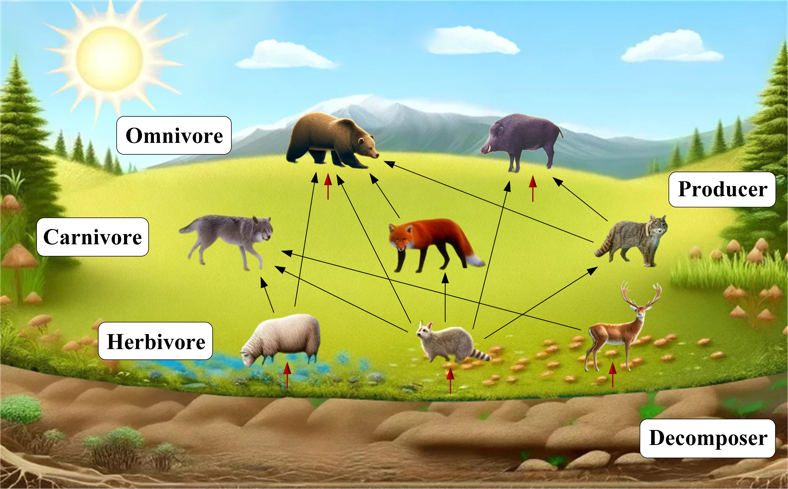

# Ecological Cycle Optimizer: A novel nature-inspired metaheuristic algorithm for global optimization

<div align="center">

<!-- <table>
<tr>
<td valign="top">
  <strong>Accepted by <em>Expert Systems with Applications</em></strong>
</td>
<td valign="top" width="60">
  <a href="https://arxiv.org/abs/2503.21860">
    
  </a>
</td>
</tr>
</table> -->
<!-- <table style="border: none; border-collapse: collapse;">
<tr>
<td valign="top">
  <strong>Accepted by <em>Expert Systems with Applications</em></strong>
</td>
<td valign="top" width="60">
  <a href="https://arxiv.org/abs/2503.21860">
    
  </a>
</td>
</tr>
</table> -->
<!-- <table style="border: none; border-collapse: collapse;">
<tr>
<td valign="top" style="border: none;">
  <strong>Accepted by <em>Expert Systems with Applications</em></strong>
</td>
<td valign="top" width="70" style="border: none;">
  <a href="https://arxiv.org/abs/2503.21860">
    
  </a>
</td>
</tr>
</table> -->

<a href="https://github.com/jiaxiao-shi/ECO-Optimizer.git">
  
</a>

<strong>Accepted by <em>Expert Systems with Applications</em></strong>


✉️[Boyu Ma*](mailto:mby9702@163.com), ✉️[Jiaxiao Shi*](mailto:jiaxiao364@gmail.com),  Yiming Ji and Zhengpu Wang.

*State Key Laboratory of Robotics and Systems, Harbin Institute of Technology*

<!-- <hr style="height:4px; border-width:0; background-color:#E6F2FF"> -->
<hr style="height:4px; border-width:0; background-color:#B0E0E6">
<!-- <hr style="height:4px; border-width:0; background-color:#ADD8E6"> -->
<!-- <hr style="height:4px; border-width:0; background-color:#AFEEEE"> -->
<!-- <hr style="height:4px; border-width:0; background-color:#D4F1F9"> -->
<!-- <hr style="height:4px; border-width:0; background-color:#0000FF"> -->

</div>

<p align="center">
    
</p>

## 📚 Table of Contents
1. [Installation](#Installation)
2. [Usage](#Usage)
3. [Results](#Results)
4. [Collaboration & Support](#Collaboration--Support)

## 🛠️ Installation
<a id="Installation"></a>

Run the following command to download our code:
```
git clone https://github.com/jiaxiao-shi/ECO-Optimizer.git
```

Our code are developed in **Matlab2023a**, please make sure the API and syntax are compatible with your software.

The structure of our project is:

```
ECO-Matlab
├── assets
│   └── images & support documents
├── ECO for FEs
│   └── main functions
├── ECO for iterations
│   └── main functions
└── README.md
```

To properly run **ECO** on your computer, please refer to [Usage](#Usage).

## 🔎 Usage
<a id="Usage"></a>

### Two versions of ECO
There are two versions of ECO for different purpose of use and evaluations:

- ECO for FEs
- ECO for iterations

The function name and structure of these two versions are exactly the same. If you want to apply **ECO** in solving <span style="color: green;">optimization problems</span>, please refer to the functions in `./ECO for iterations/`. If you want to evaluate the performance of **ECO** with a standard criteria of <span style="color: red;">maximun function evaluations (MaxFEs)</span>, please use the functions in `./ECO for FEs/`.

As for the optimization functions, we use the $\color{blue}{\text{23 classic optimization functions}}$ as benchmark. It is defined in `Get_BenchFunctions.m`. You can simply edit this file if you want to adopt other benchmarks or customized optimization functions.

### ECO for iterations


### ECO for FEs

## 📝 Results
<a id="Results"></a>

In our experiments.

For detailed information, please refer to our [paper](https://github.com/jiaxiao-shi/ECO-Optimizer.git).

## 🌍 Collaboration & Support
<a id="Collaboration--Support"></a>

💡 If you have any qustions regarding the conceptualization of ECO, please contact [Boyu Ma](mailto:mby9702@163.com). For implemention, programming and simulation problems, please contact [Jiaxiao Shi](mailto:jiaxiao364@gmail.com).

🤝 Please feel feel to contact us if you wish to work together for future studies or applications, we are open to all forms of collaborative engagements.